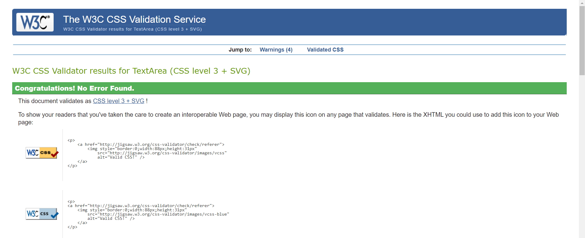
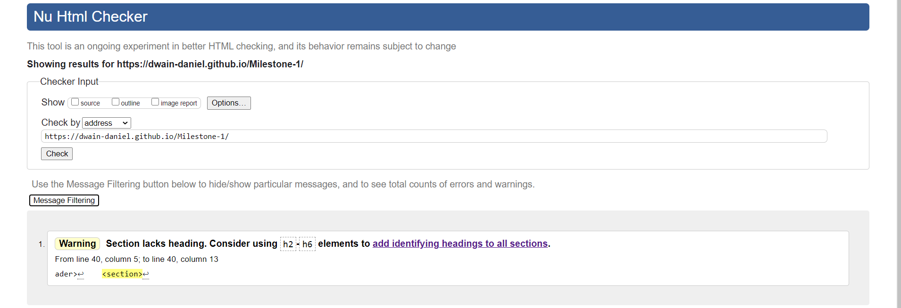
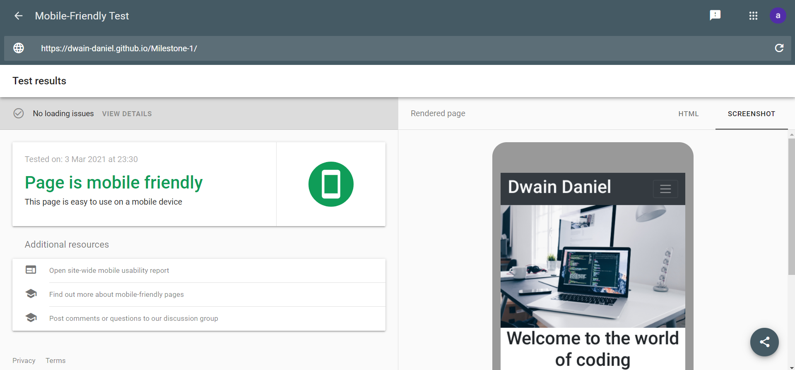

 My site can be viewed [here](https://dwain-daniel.github.io/Milestone-1/) 

<h1>Milestone Project</h1>

This project will be used to display all that I have learned so far. I will be using this project to build a website to describe what i can do and what i attain to do in the future. 
I will be using this website continuously as I learn new skills and adding new features progressively. At this moment in time i may not have all the skills
I would like to have to incorporate all the features that i would like to have in the finished article. I want the website to be easily accessible, simple to navigate and user freindly. 
It must also be displayed for various devices (desktop ,Tablet, Mobile Phone) whilst maintaining a great user experience . Links within the website directing me to other Pages either within this website
or to other social media accounts (youtube etc). I would like to have effects like hover to bring the website alive and encourages interaction

<h3>UX</h3>

<h4>User Stories</h4>

New users

<li>I want the user to easily understand the main purpose of the site and learn more about the me.</li>
<li>I want the user to be able to easily navigate throughout the site to find content.</li>
<li>I want the user to be able to find out about me and the skills I have</li>
<li>I want the user to be able to see the work I have done previously.</li>

Returning users

<li>I want the user, especially prospective employers, to be able to check my repositories and resume details.</li>
   
<h3> Design </h3>

<h4>Colour Scheme</h4>

I have used a simple black, grey and white theme. I have used this as it is classic and professional without being dull. The header and footers 
are both grey and consistent throughout all pages. The background is white, with black text. An assortment of images have been used as well that also 
fit the colour theme.

<h4>Font</h4>

I have used Google Fonts to import Exo as my primary font and Roboto as my back up fonts. These are both clean professional fonts whilst being attractive.

<h4>Wireframe</h4>

Below are the original wireframe designs I created in my designs. The final version whilst similar doesnt match exactly. This is due to me feeling the image was better
suited below the two divs.

My wireframes can be found in my wireframes folder.

<h4>Features</h4>

The links in the footer, contact and resume pages all take you to the pages described, in new tabs.
Site is responsive to different device sizes.

<h3>Features left to implement</h3>

I would like to add a number of features going forward such as:  
<li>Link the Collaboration form to an external mailbox</li>
<li>Add a download Resume button/link</li>
<li>An online store selling packages for development ideas/pricing plans</li>

<h3>Languages Used</h3>
<li>CSS</li> 
<li>HTML</li>

<h3>Technologies Used </h3>

I have built my site using: 

[<h4>CSS</h4>](https://en.wikipedia.org/wiki/CSS) 
I have used CSS to style my website

[<h4>HTML</h4>](https://en.wikipedia.org/wiki/HTML) 
I have used HTML as the main language to create my website.

[<h4>Balsamiq</h4>](https://balsamiq.com/#)
I used Balsamiq to help create my template and design a quality game. 

[<h4>Google Fonts</h4>](https://fonts.google.com/)
Google fonts were used to import the 'Exo' and 'Roboto' fonts into the style.css file which is used throughout the project.

[<h4>GitHub</h4>](https://github.com/)
I have used Github as the hosting site for my code and GitPages to deploy my game.

<h4>Git</h4>
Git is used as version control software to commit and push code to the GitHub repository where the source code is stored.

[<h4>Techsini</h4>](http://techsini.com/multi-mockup/index.php)
I have used this to create a mock up of the site on different devices

<h3>Features left to implement</h3>

I would like to add a number of features going forward such as:  
<li>Link the Collaboration form to an external mailbox</li>
<li>Add a download Resume button/link</li>
<li>An online store selling packages for development ideas/pricing plans</li>

 
<h3>Testing</h3> 

I have tested my site thoroughly, all the links are working and take the user to the correct pages. 
The contact form is fully functioning, if the user inputs an invalid message into any text field then an error message will appear. For example an 
email address with no @ symbol will bring up an error.
The webpage will respond when used on smaller devices, the nav bar will shrink down into a drop down menu. 

I placed my site throught a CSS Validator which returned no errors  
I have placed all pages through a HTML Validator which returned no errors 
I have tested my webpage using [Google Mobile Testing](https://search.google.com/test/mobile-friendly)  This returned no errors

I have viewed the site on both mobiles and laptop devices. On iPhones I have noticed that the mobile number was automatically made into a clickable link.
Whilst this is a helpful feature to promote interaction, the colour of the link is blue. This is similar to the colour of the background. This doesnt happen on the laptop.
I have tried to remove this using "< meta name="format-detection" content="telephone=no">"

<h3>Test User Stories</h3>

<h4>New Users</h4>

I want to easily understand the main purpose of the site and learn more about Dwain Daniel
Upon entering the site, users will see my name in the top left corner, followed by a hero image.
Below that there is a text section detailing what the site is about and its aims.

I want to be able to easily navigate throughout the site to find content.

The header will contain links to the other pages, this will be a responsive menu that will collapse on a mobile device. 
The footer will contain clearly labelled links to my Facebook, LinkedIn, Instagram and Twitter.

Be able to find out about me

The user can use the About me and Contact pages to find out how to get in touch with me and discover more about me.

Be able to check my repositories and resume

<h4>Returning Users</h4>
The user can see all my Git Repositories by clicking the link in the Resume page. Here they can see all the work I have done
whilst reading more about my current goals and aspirations. I have also included a GitPod link in my footer.

<h3>Deployment</h3>

I have used GitHub Pages to deploy the page using the following steps:

<li>I logged in to GitHub and located the GitHub Repository Milestone Project 1</li>
<li>I then clicked the Settings button on the menu.</li>
<li>I scrolled down the Settings page to the "GitHub Pages" Section.</li>
<li>Under "Source" I selected "Master Branch".</li>
<li>The link was then published in the "GitHub Pages" section.</li>

<h3>Credits</h3>

Media - I found my images used on https://www.pexels.com/ and https://unsplash.com/  

<h3>Acknowledgements</h3> 

I received inspiration for my project from a website I designed on https://www.wix.com/

Also I thank my mentor Spencer Barriball for helping me and providing the guidance I needed. 